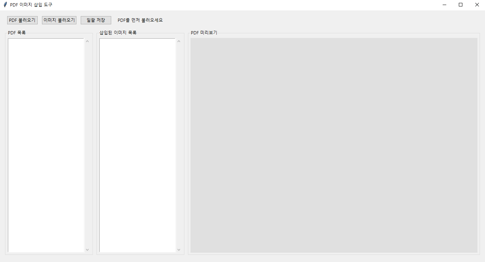

# PDF 이미지 일괄 삽입 툴 (PDF Image Inserter)

이 프로젝트는 여러 PDF 파일에 이미지를 일괄 삽입할 수 있는 GUI 도구입니다. PDF 문서에 로고, 워터마크, 서명, 도장 등을 쉽고 빠르게 삽입할 수 있습니다.



## 주요 기능

- **다중 PDF 지원**: 여러 PDF 파일을 한 번에 불러와 편집할 수 있습니다.
- **이미지 편집**: 삽입된 이미지의 위치와 크기를 직관적으로 조정할 수 있습니다.
- **일괄 저장**: 설정한 이미지 위치와 크기를 모든 PDF에 동일하게 적용하여 일괄 저장합니다.
- **사용자 친화적 인터페이스**: 드래그 앤 드롭으로 쉽게 이미지 위치와 크기를 조정할 수 있습니다.

## 사용 방법

1. **PDF 불러오기** 버튼을 클릭하여 편집할 PDF 파일들을 선택합니다.
2. **이미지 불러오기** 버튼을 클릭하여 삽입할 이미지를 선택합니다.
3. PDF 목록에서 PDF를 선택하여 미리보기를 확인합니다.
4. 미리보기 화면에서 이미지를 드래그하여 위치를 조정하거나, 우측 하단의 핸들을 드래그하여 크기를 조정합니다.
5. 다른 PDF를 선택하여 이미지 배치를 확인합니다. (이미지 설정은 모든 PDF에 동일하게 적용됩니다)
6. **일괄 저장** 버튼을 클릭하여 저장할 폴더를 선택하고 모든 PDF에 이미지를 적용하여 저장합니다.

## 설치 방법

### 요구 사항

- Python 3.6 이상
- 필요 패키지: pdf2image, Pillow, tk

### 설치 단계

1. 저장소 클론 또는 다운로드:
   ```bash
   git clone https://github.com/yourusername/pdf_image_inserter.git
   cd pdf_image_inserter
   ```

2. 의존성 설치:
   ```bash
   uv pip install -r requirements.txt
   ```

3. 실행:
   ```bash
   python main.py
   ```

## 프로젝트 구조

```
pdf_image_inserter/
├── gui/
│   └── unified_pdf_editor.py       # 통합 PDF 이미지 편집 GUI (복수 PDF 지원)
├── core/
│   ├── pdf_image_utils.py          # PDF→이미지 변환, 이미지 합성, PDF 저장 등 핵심 로직
│   └── config.py                   # poppler 경로 등 환경설정
├── resources/
│   └── poppler/                    # poppler 바이너리 등 외부 리소스
├── main.py                         # 진입점(실행 스크립트)
├── requirements.txt                # 의존성 명시(uv용)
├── .gitignore                      # Git 제외 파일 설정
└── README.md                       # 프로젝트 설명서
```

## 주요 모듈 설명

- **gui/unified_pdf_editor.py**: 통합 PDF 이미지 편집 GUI 클래스 (UnifiedPDFEditor)
- **core/pdf_image_utils.py**: PDF를 이미지로 변환, 이미지 합성, PDF로 저장 등 핵심 기능 제공
- **core/config.py**: poppler 경로 등 환경설정 상수/함수
- **resources/poppler/**: PDF 처리를 위한 poppler 바이너리 및 관련 리소스
- **main.py**: 프로그램 실행 진입점

## 라이선스

이 프로젝트는 MIT 라이선스 하에 배포됩니다. 자세한 내용은 LICENSE 파일을 참조하세요.

## 기여하기

1. 이 저장소를 포크합니다.
2. 새 기능 브랜치를 생성합니다 (`git checkout -b feature/amazing-feature`).
3. 변경사항을 커밋합니다 (`git commit -m 'Add some amazing feature'`).
4. 브랜치에 푸시합니다 (`git push origin feature/amazing-feature`).
5. Pull Request를 생성합니다.

## 연락처

프로젝트 관리자 - [@yourusername](https://github.com/yourusername) - email@example.com

프로젝트 링크: [https://github.com/yourusername/pdf_image_inserter](https://github.com/yourusername/pdf_image_inserter)