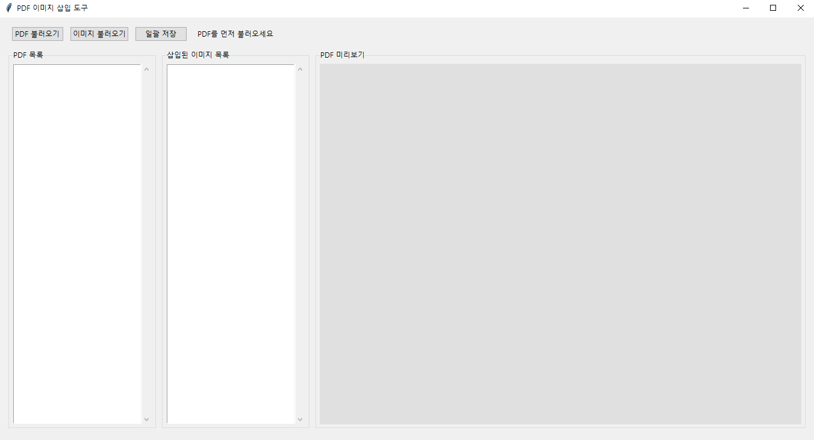

# PDF Image Editor

여러 PDF에 같은 이미지, 서명, 워터마크를 빠르게 배치하고 일괄 저장하는 데스크톱 도구입니다.



## 기능

- 여러 PDF 파일 불러오기
- 이미지 위치와 크기 미리보기 조정
- 전체 PDF에 동일한 배치 적용
- 첫 페이지만 또는 전체 페이지 저장

## 기술 스택

- Python
- Tkinter
- Pillow
- pdf2image
- PyPDF2
- Poppler

## 실행

```bash
git clone https://github.com/oiloilo44/pdf-image-editor.git
cd pdf-image-editor
uv pip install -r requirements.txt
python main.py
```

## Poppler

PDF 렌더링을 위해 Windows용 Poppler 실행 파일을 `resources/poppler`에 포함했습니다. 다른 환경에서는 `core/config.py`의 `POPPLER_PATH`를 로컬 Poppler 경로로 바꾸면 됩니다.

## 구조

```text
core/   PDF 렌더링, 페이지 수 확인, 이미지 합성
gui/    Tkinter 기반 편집 화면
main.py 실행 진입점
```
